# Codebase Genius


## 🎯 Project Overview

**Codebase Genius** is an AI-powered multi-agent system for automated codebase documentation generation. It transforms any GitHub, GitLab, Bitbucket, or Gitee repository into comprehensive, professional documentation packages.

🚀 **[View Live Demo - Streamlit App](https://codebase-genius.streamlit.app/)** | 🐛 **[Report Issues](https://github.com/OumaCavin/codebase-genius/issues)**

## ✨ Key Features

### 🤖 Multi-Agent AI Architecture
- **Repository Mapper Agent**: Analyzes repository structure and dependency graphs
- **Code Analyzer Agent**: Deep-dive analysis of code patterns, architecture, and best practices
- **DocGenie Agent**: Generates comprehensive documentation with examples and insights
- **Supervisor Agent**: Orchestrates workflow and ensures quality output

### 🌐 Multi-Platform Support
- **GitHub** repositories
- **GitLab** projects
- **Bitbucket** repositories
- **Gitee** repositories

### 📄 Multi-Format Output
- **Markdown**: Clean, GitHub-friendly documentation
- **HTML**: Web-optimized documentation with responsive design
- **PDF**: Professional, print-ready documentation packages

## 🏗️ System Architecture

```mermaid
graph TB
    User[👤 User] -->|Repository URL| API[🌐 FastAPI]
    User -->|Web Interface| UI[💻 Streamlit UI]
    
    API --> Supervisor[🎯 Supervisor Agent]
    UI --> Supervisor
    
    Supervisor --> Mapper[📊 Repository Mapper]
    Supervisor --> Analyzer[🔍 Code Analyzer]
    Supervisor --> DocGenie[📝 DocGenie Agent]
    
    Mapper --> Output[📁 Documentation Output]
    Analyzer --> Output
    DocGenie --> Output
    
    Output --> Markdown[(Markdown)]
    Output --> HTML[(HTML)]
    Output --> PDF[(PDF)]
    
    API -.-> Metrics[📈 Metrics]
    UI -.-> Metrics
```



## 🚀 Deployment Status

### ✅ **Currently Deployed**
- **GitHub Repository**: ✅ [Live](https://github.com/OumaCavin/codebase-genius)
- **Streamlit Frontend**: ✅ [Live](https://codebase-genius.streamlit.app/)
- **Backend API**: 🔄 Requires Vercel deployment (see below)

### 🔧 **Backend Deployment (Required)**
To make "API Server: Online", deploy the backend to Vercel:

1. **Install Vercel CLI** (on your local machine):
   ```bash
   npm install -g vercel
   ```

2. **Login to Vercel**:
   ```bash
   vercel login
   ```

3. **Deploy to Vercel** (in the project directory):
   ```bash
   vercel
   ```

4. **Update Streamlit Environment Variable**:
   - Go to https://share.streamlit.io
   - Click your app: **codebase-genius**
   - Go to **Settings** → **Environment variables**
   - Add: `API_BASE_URL=<your-vercel-url>`
   - Click **Rebroadcast deployment**

## 🚀 Quick Start

### Prerequisites
- Python 3.9+
- Git

### 1️⃣ Clone & Setup
```bash
git clone https://github.com/OumaCavin/codebase-genius.git
cd codebase-genius
```

### 2️⃣ Install Dependencies
```bash
pip install -r requirements.txt
```

### 3️⃣ Start Services
```bash
# Start the application
python streamlit_app.py
```

### 4️⃣ Access the System
- **Web Interface**: http://localhost:8501
- **API Base URL**: http://localhost:8000 (when running locally)

## 🔧 API Endpoints

| Endpoint | Method | Description |
|----------|--------|-------------|
| `/health` | GET | Health check endpoint |
| `/api/analyze` | POST | Start repository analysis |
| `/api/status/{workflow_id}` | GET | Get workflow status |
| `/api/workflows` | GET | List all workflows |
| `/api/download/{workflow_id}` | GET | Download documentation |
| `/api/config` | GET | Get API configuration |

## 📁 Project Structure

```
codebase-genius/
├── streamlit_app.py          # Main Streamlit application
├── api/
│   ├── index.py             # Vercel serverless entry point
│   ├── routes.py            # FastAPI routes and handlers
│   └── handlers/
│       ├── repository_handler.py    # Repository processing
│       ├── code_analyzer_handler.py # Code analysis
│       ├── docgenie_handler.py      # Documentation generation
│       └── supervisor_handler.py    # Workflow coordination
├── requirements.txt         # Python dependencies
├── vercel.json             # Vercel configuration
└── README.md               # This file
```

## 📖 Usage Examples

### 🌐 Web Interface
1. Open https://codebase-genius.streamlit.app/ or run locally
2. Enter your repository URL (e.g., `https://github.com/username/repo`)
3. Select output formats and click "Generate Documentation"
4. Monitor real-time progress and download results

### 🔌 API Usage

#### Submit Repository
```bash
curl -X POST "https://your-vercel-url.vercel.app/api/analyze" \
  -H "Content-Type: application/json" \
  -d '{
    "repository_url": "https://github.com/username/repo",
    "output_formats": ["markdown", "html"]
  }'
```

#### Check Status
```bash
curl "https://your-vercel-url.vercel.app/api/status/{workflow_id}"
```

#### Download Documentation
```bash
curl "https://your-vercel-url.vercel.app/api/download/{workflow_id}" \
  --output documentation.zip
```

## 🛠️ Supported Languages & Frameworks

| Language/Framework | Analysis Depth | Documentation Support |
|-------------------|----------------|----------------------|
| **Python** | Full AST analysis | Type hints, docstrings, classes |
| **JavaScript/TypeScript** | Full AST analysis | JSDoc, classes, modules |
| **Java** | Full AST analysis | Javadoc, classes, interfaces |
| **Go** | Full AST analysis | Go doc, functions, structs |
| **C++** | Full parsing | Doxygen, classes, templates |
| **Rust** | Full AST analysis | Rust doc, modules, traits |
| **PHP** | Full AST analysis | PHPDoc, classes, functions |
| **C#** | Full AST analysis | XML docs, classes, namespaces |
| **Ruby** | Full parsing | RDoc, classes, modules |
| **Swift** | Full AST analysis | Swift doc, classes, protocols |

## 🧪 Development

### Environment Setup
```bash
# Clone repository
git clone https://github.com/OumaCavin/codebase-genius.git
cd codebase-genius

# Create virtual environment
python -m venv venv
source venv/bin/activate  # On Windows: venv\Scripts\activate

# Install dependencies
pip install -r requirements.txt
```

### Development Commands
```bash
# Start the application
python streamlit_app.py

# Start API server locally
uvicorn api.index:app --reload
```

## 📚 Documentation

- **[User Guide](docs/user-guide.md)**: Comprehensive usage documentation
- **[API Documentation](docs/api-documentation.md)**: REST API reference
- **[Deployment Guide](docs/deployment.md)**: Production deployment instructions

## 🤝 Contributing

We welcome contributions! Here's how to get started:

1. **Fork** the repository
2. **Create** a feature branch (`git checkout -b feature/amazing-feature`)
3. **Commit** your changes (`git commit -m 'Add amazing feature'`)
4. **Push** to the branch (`git push origin feature/amazing-feature`)
5. **Open** a Pull Request

### Contribution Guidelines
- Follow PEP 8 for Python code
- Add tests for new features
- Update documentation as needed
- Ensure all tests pass before submitting PR

## 📞 Support & Contact

- **📚 Documentation**: [docs/](https://github.com/OumaCavin/codebase-genius/docs/)
- **🐛 Issues**: [GitHub Issues](https://github.com/OumaCavin/codebase-genius/issues)
- **💬 Discussions**: [GitHub Discussions](https://github.com/OumaCavin/codebase-genius/discussions)
- **📧 Email**: otienocavin@gmail.com

## 📄 License

This project is licensed under the MIT License - see the [LICENSE](LICENSE) file for details.

## ⭐ Show Your Support

If this project helped you, please consider:
- ⭐ **Starring** the repository
- 🐛 **Reporting** bugs and issues
- 💡 **Suggesting** new features
- 🤝 **Contributing** to the codebase
- 📢 **Sharing** with your developer community

---

<div align="center">

**Made with ❤️ by Cavin Otieno**

[🌟 Star on GitHub](https://github.com/OumaCavin/codebase-genius) • 
[📖 Read the Docs](https://github.com/OumaCavin/codebase-genius/docs/) • 
[💬 Join Discussions](https://github.com/OumaCavin/codebase-genius/discussions)

</div>