# Codebase Genius


## 🎯 Project Overview

**Codebase Genius** is an AI-powered multi-agent system for automated codebase documentation generation. It transforms any GitHub, GitLab, Bitbucket, or Gitee repository into comprehensive, professional documentation packages.

🚀 **[View Live Demo - Streamlit App](https://oumacavin-codebase-genius-streamlit-app-mfk2u6.streamlit.app/)** | 🐛 **[Report Issues](https://github.com/OumaCavin/codebase-genius/issues)**

## ✨ Key Features

### 🤖 Multi-Agent AI Architecture

* **Repository Mapper Agent**: Analyzes repository structure and dependency graphs
* **Code Analyzer Agent**: Deep-dive analysis of code patterns, architecture, and best practices
* **DocGenie Agent**: Generates comprehensive documentation with examples and insights
* **Supervisor Agent**: Orchestrates workflow and ensures quality output

### 🌐 Multi-Platform Support

* **GitHub** repositories
* **GitLab** projects
* **Bitbucket** repositories
* **Gitee** repositories

### 📄 Multi-Format Output

* **Markdown**: Clean, GitHub-friendly documentation
* **HTML**: Web-optimized documentation with responsive design
* **PDF**: Professional, print-ready documentation packages

## 🏗️ System Architecture

```mermaid
graph TB
    User[👤 User] -->|Repository URL| API[🌐 FastAPI]
    User -->|Web Interface| UI[💻 Streamlit UI]
    
    API --> Supervisor[🎯 Supervisor Agent]
    UI --> Supervisor
    
    Supervisor --> Mapper[📊 Repository Mapper]
    Supervisor --> Analyzer[🔍 Code Analyzer]
    Supervisor --> DocGenie[📝 DocGenie Agent]
    
    Mapper --> Output[📁 Documentation Output]
    Analyzer --> Output
    DocGenie --> Output
    
    Output --> Markdown[(Markdown)]
    Output --> HTML[(HTML)]
    Output --> PDF[(PDF)]
    
    API -.-> Metrics[📈 Metrics]
    UI -.-> Metrics
```



## 🚀 Deployment Status

### ✅ **Currently Deployed**

* **GitHub Repository**: ✅ [Live](https://github.com/OumaCavin/codebase-genius)
* **Streamlit Frontend**: ✅ [Live](https://oumacavin-codebase-genius-streamlit-app-mfk2u6.streamlit.app/)
* **Backend API**: 🔄 [Vercel Deployment Guide](deployment/PRODUCTION_DEPLOYMENT.md)

### 🔧 **Backend Deployment (Required)**

To make “API Server: Online”, deploy the backend to Vercel:

1. **Install Vercel CLI**

   ```bash
   npm install -g vercel
   ```

2. **Login to Vercel**

   ```bash
   vercel login
   ```

3. **Deploy to Vercel**

   ```bash
   vercel
   ```

4. **Update Streamlit Environment Variable**

   * Go to [Streamlit Cloud](https://share.streamlit.io)
   * Click your app: **codebase-genius**
   * Go to **Settings → Environment variables**
   * Add:

     ```
     API_BASE_URL=<your-vercel-url>
     ```
   * Click **Rebroadcast deployment**

## 🚀 Quick Start

### Prerequisites

* Python 3.9+
* Git

### 1️⃣ Clone & Setup

```bash
git clone https://github.com/OumaCavin/codebase-genius.git
cd codebase-genius
```

### 2️⃣ Install Dependencies

```bash
pip install -r requirements.txt
```

### 3️⃣ Start Services

```bash
# Start the application
python streamlit_app.py
```

### 4️⃣ Access the System

* **Web Interface**: [http://localhost:8501](http://localhost:8501)
* **API Base URL**: [http://localhost:8000](http://localhost:8000)

## 🔧 API Endpoints

| Endpoint                      | Method | Description               |
| ----------------------------- | ------ | ------------------------- |
| `/health`                     | GET    | Health check endpoint     |
| `/api/analyze`                | POST   | Start repository analysis |
| `/api/status/{workflow_id}`   | GET    | Get workflow status       |
| `/api/workflows`              | GET    | List all workflows        |
| `/api/download/{workflow_id}` | GET    | Download documentation    |
| `/api/config`                 | GET    | Get API configuration     |

## 📁 Project Structure

```
codebase-genius/
├── streamlit_app.py
├── api/
│   ├── index.py
│   ├── routes.py
│   └── handlers/
│       ├── repository_handler.py
│       ├── code_analyzer_handler.py
│       ├── docgenie_handler.py
│       └── supervisor_handler.py
├── requirements.txt
├── vercel.json
└── README.md
```

## 📖 Usage Examples

### 🌐 Web Interface

1. Open [https://oumacavin-codebase-genius-streamlit-app-mfk2u6.streamlit.app/](https://oumacavin-codebase-genius-streamlit-app-mfk2u6.streamlit.app/)
2. Enter your repository URL (e.g., `https://github.com/username/repo`)
3. Select output formats and click **Generate Documentation**
4. Monitor progress and download results

### 🔌 API Usage

#### Submit Repository

```bash
curl -X POST "https://your-vercel-url.vercel.app/api/analyze" \
  -H "Content-Type: application/json" \
  -d '{
    "repository_url": "https://github.com/username/repo",
    "output_formats": ["markdown", "html"]
  }'
```

#### Check Status

```bash
curl "https://your-vercel-url.vercel.app/api/status/{workflow_id}"
```

#### Download Documentation

```bash
curl "https://your-vercel-url.vercel.app/api/download/{workflow_id}" \
  --output documentation.zip
```

## 🛠️ Supported Languages & Frameworks

| Language/Framework    | Analysis Depth    | Documentation Support           |
| --------------------- | ----------------- | ------------------------------- |
| Python                | Full AST analysis | Type hints, docstrings, classes |
| JavaScript/TypeScript | Full AST analysis | JSDoc, classes, modules         |
| Java                  | Full AST analysis | Javadoc, classes, interfaces    |
| Go                    | Full AST analysis | Go doc, functions, structs      |
| C++                   | Full parsing      | Doxygen, classes, templates     |
| Rust                  | Full AST analysis | Rust doc, modules, traits       |
| PHP                   | Full AST analysis | PHPDoc, classes, functions      |
| C#                    | Full AST analysis | XML docs, classes, namespaces   |
| Ruby                  | Full parsing      | RDoc, classes, modules          |
| Swift                 | Full AST analysis | Swift doc, classes, protocols   |

## 🧪 Development

### Environment Setup

```bash
git clone https://github.com/OumaCavin/codebase-genius.git
cd codebase-genius
python -m venv venv
source venv/bin/activate  # On Windows: venv\Scripts\activate
pip install -r requirements.txt
```

### Development Commands

```bash
python streamlit_app.py
uvicorn api.index:app --reload
```

## 📚 Documentation

* **[User Guide](docs/user-guide.md)**
* **[API Documentation](docs/api-documentation.md)**
* **[Deployment Guide](deployment/PRODUCTION_DEPLOYMENT.md)**
  *(Also see [LOCAL_DEPLOYMENT.md](deployment/LOCAL_DEPLOYMENT.md))*

## 🤝 Contributing

We welcome contributions!

1. Fork the repository
2. Create a feature branch
3. Commit changes
4. Push to branch
5. Open a Pull Request

### Guidelines

* Follow PEP 8
* Add tests for new features
* Update docs as needed
* Ensure all tests pass

## 📞 Support & Contact

* 📚 [Documentation Directory](https://github.com/OumaCavin/codebase-genius/tree/main/docs)
* 🐛 [GitHub Issues](https://github.com/OumaCavin/codebase-genius/issues)
* 💬 [GitHub Discussions](https://github.com/OumaCavin/codebase-genius/discussions)
* 📧 **Email:** [otienocavin@gmail.com](mailto:otienocavin@gmail.com)

## 📄 License

Licensed under the MIT License — see [LICENSE](LICENSE)

## ⭐ Show Your Support

If this project helped you:

* ⭐ Star the repo
* 🐛 Report bugs
* 💡 Suggest features
* 🤝 Contribute
* 📢 Share with others

---

<div align="center">

**Made with ❤️ by Cavin Otieno**

[🌟 Star on GitHub](https://github.com/OumaCavin/codebase-genius) •
[📖 Read the Docs](https://github.com/OumaCavin/codebase-genius/tree/main/docs) •
[💬 Join Discussions](https://github.com/OumaCavin/codebase-genius/discussions)

</div>
